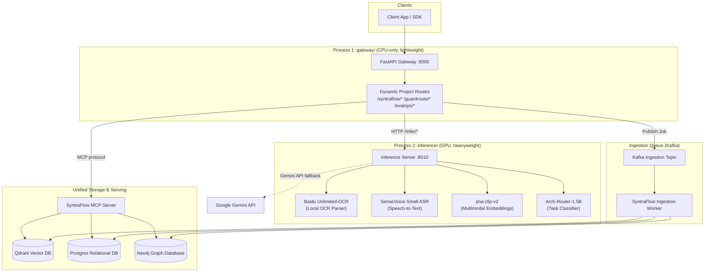

# ContAIned AI Platform Monorepo

This repository is a monorepo containing multiple AI/ML project submodules and shared infrastructure. It is modeled after standard enterprise plug-and-play AI monorepos.

## Repository Structure

The monorepo contains a dynamic multi-backend layout, isolating GPU server workloads, API gateway routing, and individual Git project submodules:

```
c:\Akshat\proj\
├── pyproject.toml           # Root: base dependencies + optional groups
├── .gitignore
├── .gitmodules              # Git submodule path and remote URL mapping
├── .env.example             # Shared environment configuration template
├── README.md                # Platform documentation and startup guide
├── agent.md                 # Base AI developer agent guidelines
│
├── common/                  # Shared library (imported by all backends/submodules)
│   ├── config/              # Composed Pydantic-settings
│   ├── clients/             # Postgres, Qdrant, Neo4j, LiteLLM, and Inference HTTP clients
│   ├── observability/       # OpenTelemetry tracing and structured loggers
│   └── schemas/             # Standard schemas (SubAgentResult, MCP types)
│
├── gateway/                 # Process 1: CPU-only FastAPI API Gateway
│   ├── main.py              # Main gateway runner (port 8000)
│   ├── core/setup.py        # lifespan hook dynamically loading active projects
│   └── api/                 # Dynamic router discovery and health routes
│
├── inference/               # Process 2: GPU-bound Model Inference Server
│   ├── main.py              # Model loader and server API (port 8010)
│   ├── core/vram_manager.py # Singleton model lifecycle arbiter (LRU eviction, idle cleanups)
│   ├── models/              # Mock weight wrappers (Baidu OCR, SenseVoice, classifier)
│   └── routes/              # Post endpoint routes (ocr, embed, transcribe, classify)
│
├── projects/                # Process 3: Git submodule project folders
│   ├── syntraflow/          # Document & Video Ingestion / Hybrid RAG Retrieval (MCP)
│   ├── guardroute/          # Orchestrator Graph / Scatter-Gather Routing / LLM Synthesis
│   └── evalops/             # Evaluation DeepEval tests / MMLU benchmarks / Developer Dashboard
│
└── infrastructure/          # Deployment configs
    ├── docker-compose.yml   # Starts PostgreSQL, Qdrant, Neo4j, gateway, and inference
    ├── Dockerfile.gateway   # Lightweight gateway CPU image
    └── Dockerfile.inference # GPU inference server image (llama-cpp-python)
```

---

## Working with Project Submodules

The project directories in `projects/` are managed as Git submodules.

### Initialize/update submodules:
```bash
git submodule update --init --recursive
```

---

## Plug-and-Play Configuration

You can enable or disable projects dynamically via the `ACTIVE_PROJECTS` variable in your `.env` file:

```env
ACTIVE_PROJECTS=["syntraflow", "guardroute", "evalops"]
```

When the gateway starts up, it will only load routes and setup hooks for the listed active projects.

---

## System Architecture

The platform partitions CPU-bound API routing, asynchronous job queuing, GPU-bound model inference, and unified retrieval databases:



---

## Installing Dependencies

We use Poetry to manage dependencies. You can install all optional project submodules or just specific ones:

**Install base dependencies + all project modules:**
```bash
poetry install --all-extras
```

**Install only SyntraFlow & GuardRoute:**
```bash
poetry install --extras "syntraflow" --extras "guardroute"
```

**Install only local inference dependencies:**
```bash
poetry install --extras "inference"
```

---

## Running Locally

Use Docker Compose to run the full stack:

```bash
docker compose -f infrastructure/docker-compose.yml up
```

This starts:
- PostgreSQL (database)
- Qdrant (vector DB)
- Neo4j (graph database for GraphRAG)
- gateway (port 8000)
- inference server (port 8010, GPU-accelerated)
