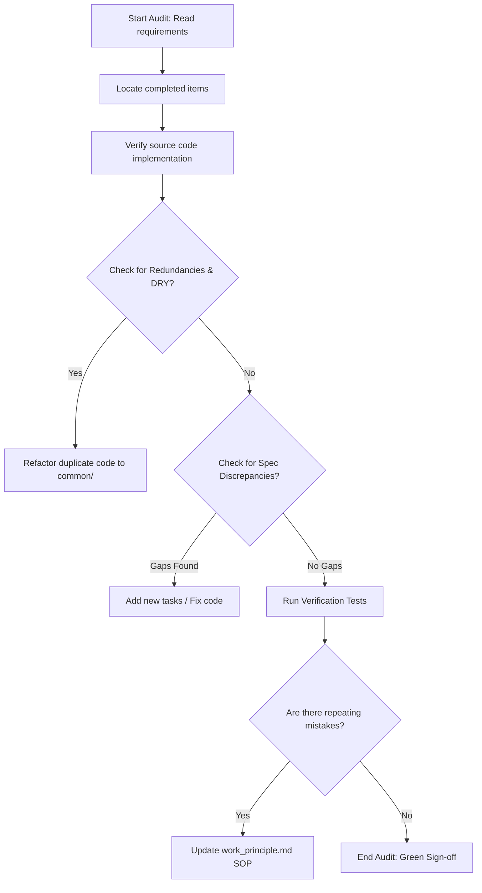

# Standard Operating Procedure: How to Verify and Audit Completed Tasks (`work_verification.md`)

This document defines the official verification, audit, and quality assurance protocol for developers and AI agents to check completed tasks in the Akshat AI Platform Monorepo. Use this process to discover redundancies, check for specification discrepancies, and feedback learnings into the system.

---

## 1. Audit Trigger & Scope
Whenever a set of tasks is marked as completed (`[x]`) in any requirement markdown files (`requirements/*.md`):
1. **Identify Target Scope:** Retrieve the git commit diff or active changes corresponding to the tasks.
2. **Focus Only on Completed Items:** Walk through each requirement checklist item marked `[x]` in the active cycle.

---

## 2. Work Checking Flow (Step-by-Step)

### Step 1: Trace Code to Specification
Ensure every checked item (`[x]`) can be traced to active code.
- Locate the functions, classes, and configurations modified or added.
- **Discrepancy Check:** Compare the implementation against the requirement schemas, constants, or behavior described.
- *Examples of common discrepancies:* Missing validation fields, incorrect API port mapping, hardcoded fallback chains, missing timeout handlers.

### Step 2: Redundancy & DRY Audit
Check if the changes introduced duplicate code patterns that violate the monorepo design principles.
- Check if helper functions or client logic already exist elsewhere (e.g. in `common/` or another project submodule).
- If redundant logic is found:
  1. Refactor the helper or client out of the submodule.
  2. Centralize it within `common/` (e.g., config, database clients, or schemas).
  3. Update both submodules to import from the shared library.

### Step 3: Run Verification Tests
Verify that tests exist and cover the changes.
- Ensure that unit tests are added or updated to cover positive, negative, and fallback paths.
- Execute the test suite and ensure all tests pass.

### Step 4: Feedback Loop to Work Principles
If you notice certain repeated mistakes or items that were completely overlooked (e.g. settings validation, environment caching in tests, logging format mismatches):
- **Update the SOP:** Immediately add a rule or guideline to [work_principle.md](file:///c:/Akshat/ContAIned/requirements/work_principle.md) under Section 4 ("Quality, Design, & Maintainability") to prevent future occurrences.

---

## 3. Tool Reference Checklist

Below is the list of tools and commands to be used during the verification flow:

| Audit Action | Tool/Command | Description / Example Usage |
|---|---|---|
| **Trace Code & References** | `grep_search` | Search for usage of settings fields, clients, or specific models across the codebase to ensure consistency. *Example:* Search for duplicate connection pools in `projects/` using query `create_async_engine`. |
| **Locate Checklist Progress** | `grep_search` | Run regex search `\[x\]` on the `requirements/` directory to inspect completed checklist tasks. |
| **Static Code Inspection** | `view_file` | Review code blocks for proper types, log configuration, and structural logic. |
| **Analyze Active Changes** | `run_command` with `git diff` | Run `git diff` to view exactly what changed in the current workspace compared to the branch baseline. |
| **Verify Test Quality** | `run_command` with `pytest` | Execute `poetry run pytest` (or specific tests) to verify regressions and test suite health. |
